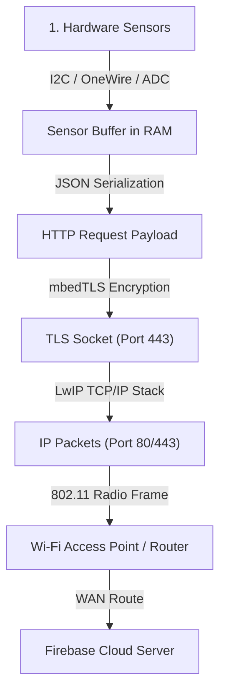
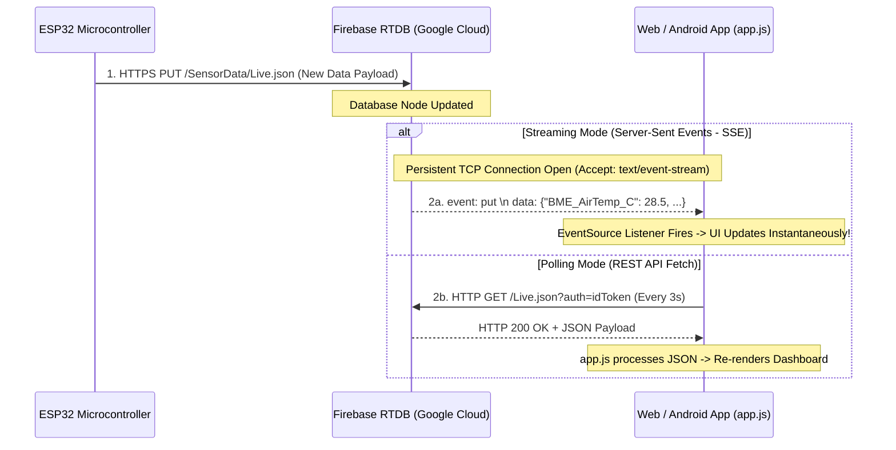

# Soil & Air Telemetry Studio — Low-Level Engineering & Architecture Guide

> **Author:** Ciel (Antigravity Assistant)  
> **Target Audience:** Apurba Maity  
> **Project Directory:** [`/home/apurba/Projects/soil-air-dashboard/`](file:///home/apurba/Projects/soil-air-dashboard/)  

This document provides a **deep-dive technical breakdown of the actual mechanisms and underlying protocols** powering every layer of the Soil & Air Telemetry Studio — from raw Wi-Fi socket packets on the ESP32 up to cloud server streaming, native Android compilation, and web app algorithmic logic.

---

## 🛜 1. Microcontroller Network Stack: How ESP32 Transmits Over Wi-Fi

The ESP32 does not simply "send data"; it executes a multi-layered networking stack running on the **FreeRTOS** real-time operating system using the **LwIP (Lightweight IP)** network stack.



### A. Wi-Fi Connection & Radio Handshake (Station Mode)
1. **Radio Association (`WiFi.begin(SSID, PASS)`)**:
   - The ESP32 2.4GHz RF transceiver switches to **Station (STA) Mode**.
   - It broadcasts probe requests to find your Wi-Fi Access Point (AP).
   - Performs the **WPA2-PSK 4-Way Handshake** to negotiate pairwise master keys (PMK) and establish AES-CCMP wireless link encryption.
2. **DHCP & IP Assignment**:
   - The LwIP stack sends a DHCP Discover packet over Wi-Fi.
   - Your home router's DHCP server responds with a **Local IP Address** (e.g., `192.168.1.50`), **Subnet Mask** (`255.255.255.0`), and **Default Gateway** (e.g., `192.168.1.1`).
3. **DNS Resolution**:
   - The ESP32 needs to reach `esp32-soil-and-air-default-rtdb.asia-southeast1.firebasedatabase.app`.
   - It sends a UDP DNS query (Port 53) to your router. The DNS server returns the public IPv4 address of Google Cloud's Firebase load balancer (e.g., `142.250.190.46`).

### B. Secure TLS Socket & HTTPS Request (`mbedTLS`)
Raw HTTP is rejected by Firebase for security reasons. The ESP32 must establish a secure **HTTPS connection**:
1. **TCP Socket Creation**: The ESP32 opens a standard TCP socket to Google's IP address on **Port 443**.
2. **TLS 1.2 Handshake (`mbedTLS` library)**:
   - **ClientHello**: ESP32 sends supported cipher suites.
   - **ServerHello & Certificate**: Firebase sends its TLS SSL Certificate.
   - **Key Exchange & Symmetric Cipher**: ESP32 verifies or accepts the certificate and negotiates an encrypted AES-128-GCM session key.
3. **HTTP Header Construction & Transmission**:
   Once the encrypted TLS tunnel is open, the ESP32 formats a raw HTTP request string into the TLS socket:
   ```http
   PUT /SensorData/SoilAirSuite/Live.json?auth=YOUR_FIREBASE_SECRET HTTP/1.1
   Host: esp32-soil-and-air-default-rtdb.asia-southeast1.firebasedatabase.app
   Content-Type: application/json
   Content-Length: 238
   Connection: close

   {
     "BME_AirTemp_C": 28.50,
     "BME_AirHum_Pct": 64.20,
     "BME_Press_hPa": 1008.30,
     "AHT_AirTemp_C": 28.40,
     "AHT_AirHum_Pct": 64.80,
     "SoilTemp_C": 26.80,
     "CapMoist_Pct": 72.50,
     "ResMoist_Pct": 68.10,
     "SD_Status": "OK",
     "Timestamp": "2026-08-12T23:40:00"
   }
   ```
4. **Packet Routing**: The packet travels from ESP32 RF antenna $\rightarrow$ Wi-Fi Router $\rightarrow$ Fiber/DSL Modem $\rightarrow$ ISP Gateway $\rightarrow$ Internet Backbone $\rightarrow$ Google Cloud Load Balancer $\rightarrow$ Firebase Realtime Database Engine.

---

## ☁️ 2. Cloud-to-Client Streaming: How Firebase Pushes Data to Website & App

How does data updated in Google Cloud arrive on your mobile phone screen or browser?



### A. The Engine Behind Real-Time Cloud Updates
Firebase Realtime Database is built on top of **Server-Sent Events (SSE / EventSource over HTTP/1.1 & HTTP/2)** and **WebSockets**.

1. **Persistent TCP Connection (SSE)**:
   - When a browser connects via Firebase SDK or REST streaming endpoint (`https://<db>.firebasedatabase.app/SensorData.json`), it sends:
     ```http
     GET /SensorData.json?auth=idToken HTTP/1.1
     Accept: text/event-stream
     ```
   - Google's cloud server responds with `HTTP 200 OK` and `Content-Type: text/event-stream`, but **it DOES NOT close the TCP socket**.
   - The connection remains open continuously in a "listening" state.
2. **Push Mechanism**:
   - The moment the ESP32 writes new data to `/SensorData/SoilAirSuite/Live`, Google's backend triggers an event.
   - Google's cloud server immediately pushes a text chunk down the open TCP pipe:
     ```http
     event: put
     data: {"path": "/Live", "data": {"BME_AirTemp_C": 28.5, ...}}
     ```
   - The browser's networking thread receives the incoming chunk and fires a JavaScript event in `0ms` latency!

### B. REST Polling & Google Identity Auth in [`app.js`](file:///home/apurba/Projects/soil-air-dashboard/app.js)
In our implementation, we use a failsafe **REST Polling Pipeline with OAuth2 ID Tokens**:
1. **Security Token Exchange (`getFirebaseIdToken()`)**:
   - Firebase rules require authentication (`"auth != null"`).
   - [`app.js`](file:///home/apurba/Projects/soil-air-dashboard/app.js) sends a background HTTP `POST` to:
     `https://identitytoolkit.googleapis.com/v1/accounts:signInWithPassword?key=API_KEY`
   - Google Identity Toolkit validates the account credentials (`apurbamaity227@gmail.com`) and returns a signed **JWT (JSON Web Token)** called `idToken`.
2. **3-Second Data Sync Loop**:
   - `setInterval(fetchLiveData, 3000)` executes `fetch('https://.../Live.json?auth=' + idToken)`.
   - The server validates the token signature and returns the latest payload JSON.

---

## 📱 3. Android APK Compilation & Native Bridge Mechanics

How does a web application (`index.html`, `style.css`, `app.js`) transform into a native `.apk` file that installs and runs on Android?

```mermaid
flowchart TD
    WEB_SRC["Web Source Files (index.html, style.css, app.js)"] -->|npx cap sync| ASSETS["android/app/src/main/assets/public/"]
    
    subgraph Gradle ["Android Gradle Build Toolchain"]
        JAVA_SRC["Capacitor Java Wrapper (BridgeActivity.java)"] -->|javac / kotlinc| BYTECODE[".class Java Bytecode"]
        BYTECODE -->|d8 / r8 DEX Compiler| DEX["classes.dex (Dalvik Executable)"]
        ASSETS & DEX & MANIFEST["AndroidManifest.xml"] -->|aapt2 Packager| UNALIGNED["Unaligned APK"]
        UNALIGNED -->|zipalign| ALIGNED["Aligned APK"]
        ALIGNED -->|apksigner (android.keystore)| SIGNED_APK["soil_air_telemetry_studio.apk (v1 + v2 Signed)"]
    end
```

### A. Capacitor Native WebView Container
The compiled APK is **NOT** running inside Google Chrome tab or browser TWA. It is a full-fledged **Native Android App**:
- Android apps are initialized by `MainActivity` (extending [`BridgeActivity`](file:///home/apurba/Projects/soil-air-dashboard/android/app/src/main/java/dev/antigravity/telemetry/MainActivity.java)).
- `BridgeActivity` creates a native Android UI container called `android.webkit.WebView`.
- When the app launches, the `WebView` loads local assets directly from the phone's internal storage (`file:///android_asset/public/index.html` or `https://localhost`).

### B. The Step-by-Step APK Build Pipeline
When running `./gradlew assembleRelease` inside the [`android`](file:///home/apurba/Projects/soil-air-dashboard/android) directory:
1. **Asset Injection**: Capacitor copies all HTML, CSS, JavaScript, icons, and libraries into `android/app/src/main/assets/public/`.
2. **Java Compilation (`javac`)**: Compiles Java files (`BridgeActivity.java`, plugin bridges) into standard JVM bytecode `.class` files.
3. **DEX Compilation (`d8` compiler)**: Converts JVM `.class` bytecode into **Dalvik Executable (`classes.dex`)** format, which is the native bytecode run by the **Android Runtime (ART)** on ARM/ARM64 mobile processors.
4. **Resource Packaging (`aapt2`)**: Compiles Android resources (`AndroidManifest.xml`, launcher icons, vector drawables) into binary format.
5. **ZIP Alignment (`zipalign`)**: Aligns uncompressed assets on 4-byte boundaries so the Android OS can memory-map files directly from storage without loading everything into RAM.
6. **APK Signature Scheme v2 (`apksigner`)**:
   - Modern Android (Android 11+) rejects APKs signed with legacy v1 JAR signatures.
   - `apksigner` uses our PKCS#12 key store ([`android.keystore`](file:///home/apurba/Projects/soil-air-dashboard/android.keystore)) to calculate cryptographic SHA-256 hashes of **the entire APK binary file byte array**.
   - It appends an **APK Signing Block** before the ZIP Central Directory, guaranteeing the APK cannot be tampered with or modified.

### C. The JavaScript $\leftrightarrow$ Native Android Bridge Architecture
When JavaScript in [`app.js`](file:///home/apurba/Projects/soil-air-dashboard/app.js) executes native operations (like saving a file or opening the native Android Share Sheet):

```
[JavaScript Runtime (app.js)] 
       │ 
       ▼ Capacitor.nativeExec("Filesystem", "writeFile", options)
[JS-to-Native Bridge (window.androidBridge)]
       │ 
       ▼ postMessage() / prompt() intercepter
[Android Bridge Java Engine (Bridge.java)]
       │ 
       ▼ Plugin Method Resolver
[FilesystemPlugin.java (Native Java)]
       │ 
       ▼ Android OS API (Context.getCacheDir(), FileProvider, Intent)
[Android Operating System]
```

1. JS calls `@capacitor/filesystem` or `@capacitor/share`.
2. Capacitor JS library serializes parameters into a JSON string and invokes `window.androidBridge.postMessage(json)`.
3. The underlying Android Java class `Bridge.java` catches the call, identifies the target plugin (`FilesystemPlugin.java`), and executes native Java code using Android SDK APIs (`android.content.Intent`, `android.net.Uri`).
4. Once the Android OS completes the operation, `Bridge.java` evaluates JavaScript in the `WebView` (`webView.evaluateJavascript("window.Capacitor.fromNative(...)")`) to resolve the JavaScript Promise!

---

## 🧠 4. Core Logic & Algorithms of the Website & App

### A. Historical Data Ingestion & JSON Flattening
Firebase Realtime Database stores historical pushes as key-value JSON objects keyed by auto-generated push IDs:
```json
{
  "-O1a2b3c4d5e": { "Timestamp": "2026-08-12T20:00:00", "BME_AirTemp_C": 28.2 },
  "-O1a2b3c4d5f": { "Timestamp": "2026-08-12T20:00:10", "BME_AirTemp_C": 28.3 }
}
```

In [`app.js`](file:///home/apurba/Projects/soil-air-dashboard/app.js):
1. **Flattening**: `Object.values(rawHistoryData)` converts the JSON map into an array of objects.
2. **Timezone-Safe Parsing**: Timestamps (`YYYY-MM-DDTHH:mm:ss`) are converted to Unix epoch milliseconds using `Date.parse(timestamp)`.
3. **Sorting**: Array is sorted chronologically (`a.timestamp - b.timestamp`).
4. **Filtering**: The global timeline selector filter (`15m`, `1h`, `24h`, `7d`, `All`) filters the array by subtracting millisecond durations from `Date.now()`.

### B. Dynamic Stock-Chart Analytics & Offline Power Gap Algorithm
Standard line charts draw continuous lines between data points. If the ESP32 is powered off for 2 hours, standard charts draw an artificial straight diagonal line across the 2-hour gap, creating misleading graphs.

Our custom Stock-Chart engine solves this with a 3-step algorithm:

1. **`spanGaps: false` Configuration**:
   - In Chart.js, setting `spanGaps: false` instructs the canvas renderer to **lift the drawing pen** whenever a `null` data point is encountered.
2. **Heartbeat & Status Calculation**:
   - The app checks the age of the latest entry: `ageInSeconds = (Date.now() - latestTimestamp) / 1000`.
   - If `ageInSeconds > 35`: The ESP32 is marked 🔴 `Offline`.
3. **Current Time ("Now") Axis Extension**:
   - If the ESP32 is offline, `app.js` pushes a synthetic label to the x-axis: `"Now (" + currentTimeString + ")"`.
   - It appends `null` values for all sensor datasets at this "Now" index.
   - **Result**: Chart.js extends the time axis all the way to the current wall-clock time, but leaves an un-drawn, visible blank gap starting from the last logged packet up to "Now" — exactly how real-world stock market trading platforms display closed market hours!

```
Sensor Data:  [28.1°C, 28.2°C, 28.3°C,  null  ]
Time Axis:    [07:50,  07:55,  08:00,   Now (09:05)]
Graph Line:   ─────●──────●──────●     (Visible Gap)
```

### C. Multi-Engine 4-Layer CSV Exporter Engine
Standard web browsers download files using HTML5 anchor tags: `<a href="data:text/csv..." download="log.csv">`. However, **Android native WebViews block `data:` and `blob:` download links for security reasons**, throwing an `ERR_UNKNOWN_URL_SCHEME` error.

To guarantee CSV export works on every device, [`app.js`](file:///home/apurba/Projects/soil-air-dashboard/app.js) evaluates runtime capabilities through a 4-tier decision tree:

```mermaid
flowchart TD
    EXPORT_BTN["User Clicks Export CSV Log"] --> RUNTIME_CHK{"Check Runtime Environment"}
    
    RUNTIME_CHK -->|Capacitor.isNativePlatform() == true| TIER1["Tier 1: Native Android Capacitor Engine"]
    TIER1 --> WRITE_FILE["@capacitor/filesystem writes CSV string to cache directory"]
    WRITE_FILE --> NATIVE_SHARE["@capacitor/share launches Android Native Share Sheet Intent"]
    NATIVE_SHARE --> SUCCESS_NATIVE["User saves to Google Drive, WhatsApp, Files, or Downloads"]

    RUNTIME_CHK -->|Mobile Web Browser| TIER2["Tier 2: Web Share API (navigator.share)"]
    TIER2 --> SHARE_FILE["Shares File object directly to OS Share Sheet"]

    RUNTIME_CHK -->|Desktop Web Browser| TIER3["Tier 3: HTML5 Blob URL Engine"]
    TIER3 --> BLOB_DL["URL.createObjectURL(blob) + Virtual <a> Click"]

    TIER1 & TIER2 & TIER3 -->|If Permission Fails| TIER4["Tier 4: Emergency Clipboard Modal"]
    TIER4 --> COPY_CLIPBOARD["Displays CSV in text area with 1-Tap 'Copy to Clipboard' Button"]
```

---

## 🛠️ Summary Matrix of Tech Stack Technologies

| Layer | Component | Core Technology / Protocol | Function |
| :--- | :--- | :--- | :--- |
| **Firmware** | Network Stack | LwIP on FreeRTOS | 802.11 Wi-Fi, DHCP, DNS, TCP/IP sockets |
| **Firmware** | Security | `mbedTLS` | TLS 1.2 RSA/AES-128 encryption on Port 443 |
| **Firmware** | Protocol | HTTP/1.1 REST `PUT` | Sends JSON sensor payloads to Firebase endpoint |
| **Cloud** | Database | Firebase Realtime DB | Host JSON tree on Google Cloud infrastructure |
| **Cloud** | Streaming | Server-Sent Events (SSE) | Persistent TCP streams (`text/event-stream`) pushing data in 0ms |
| **Cloud** | Auth | Google Identity Toolkit | Exchanging API keys + user credentials for OAuth2 JWT `idToken` |
| **Android** | Native Wrapper | Capacitor 8 + Android WebView | Runs `HTML/CSS/JS` natively inside `BridgeActivity` |
| **Android** | Compilation | Gradle, `javac`, `d8`, `aapt2` | Compiles Java/Web assets into `classes.dex` and APK package |
| **Android** | Signing | `apksigner` + `android.keystore` | APK Signature Scheme v2 (file-level RSA signature) |
| **Frontend** | Analytics | Chart.js 4 (HTML5 Canvas 2D) | High-performance stock-chart rendering with gap handling |
| **Frontend** | Interop | Capacitor Native Exec Bridge | Inter-process JS-to-Java communication for native storage & share sheets |

---
*Document compiled and maintained by Ciel for Apurba Maity.*
