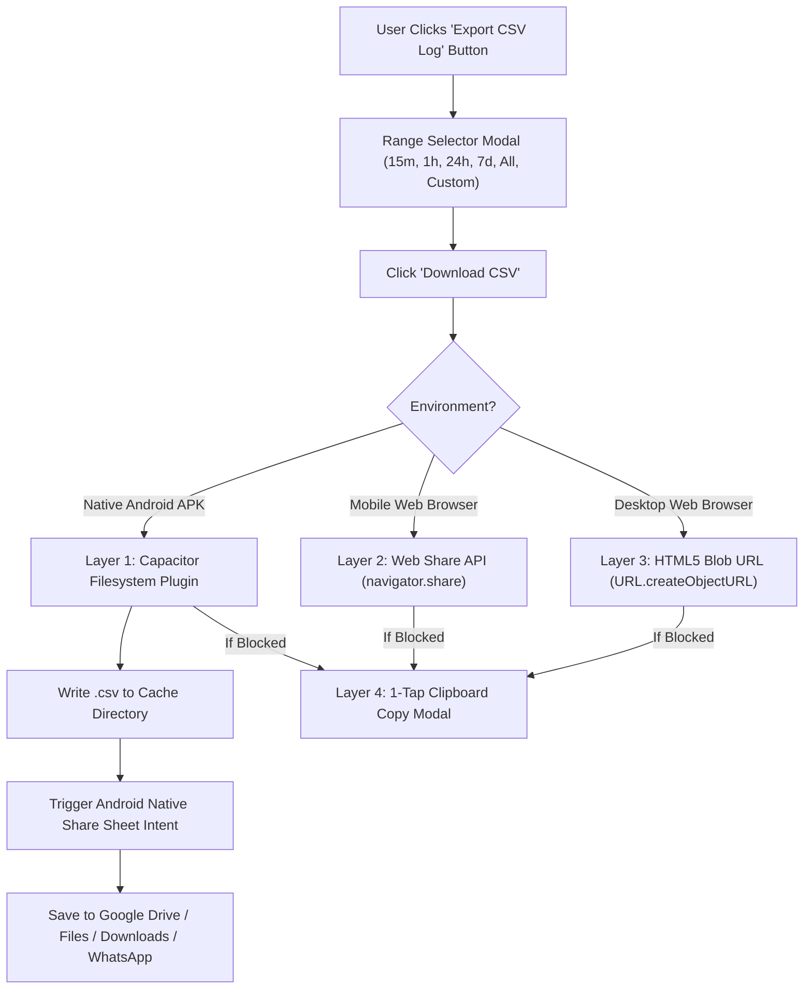

# Soil & Air Telemetry Studio — System Architecture & Technical Guide

Welcome! This guide explains **how every piece of your system works under the hood** — from the electronic sensors connected to your ESP32, up to the cloud database, website, and native Android mobile application.

---

## 📐 1. System Overview Architecture

Here is the end-to-end data flow:

```mermaid
flowchart TD
    subgraph Hardware ["Hardware Layer (ESP32)"]
        S1["BME280 (Air Temp/Hum/Pressure - I2C 0x76)"]
        S2["AHT20 (Air Temp/Hum - I2C 0x38)"]
        S3["DS18B20 (Soil Temp Probe - GPIO 4)"]
        S4["Capacitive Soil Moisture (ADC 34)"]
        S5["Resistive Soil Moisture (ADC 35)"]
        SD["MicroSD SPI Datalogger (CS Pin 5 @ 4MHz)"]
        OLED["OLED Display (128x64 I2C 0x3C)"]
    end

    subgraph Cloud ["Cloud Layer (Firebase RTDB)"]
        FB_AUTH["Google Identity Toolkit (REST Auth)"]
        FB_DB["Firebase Realtime Database (/SensorData/SoilAirSuite)"]
    end

    subgraph App ["Application Layer (Web & Android APK)"]
        WEB["PWA Web Dashboard (HTML5/CSS3/JS)"]
        CAP["Capacitor Android Native Bridge"]
        NAV["Native Bottom Navigation (Metrics, Charts, History, Diag)"]
        STOCK["Stock-Chart Analytics Engine (SpanGaps: false + Timeline Window)"]
        CSV_ENGINE["4-Layer CSV Exporter Engine (@capacitor/filesystem & Share)"]
    end

    S1 & S2 & S3 & S4 & S5 --> Hardware
    Hardware -->|10s Append| SD
    Hardware -->|Visual Alert| OLED
    Hardware -->|HTTPS POST| FB_DB

    FB_AUTH -->|ID Token| App
    FB_DB -->|REST API Poll (3s)| App
    
    App --> NAV
    App --> STOCK
    App --> CSV_ENGINE
```

---

## ⚡ 2. Firmware & ESP32 Microcontroller Layer

### File Location: [`ESP32_UNIFIED_SOIL_AIR_FIREBASE_SD.ino`](file:///home/apurba/Arduino/ESP32_UNIFIED_SOIL_AIR_FIREBASE_SD/ESP32_UNIFIED_SOIL_AIR_FIREBASE_SD.ino)

### Sensor Communication Interfaces:
1. **I2C Bus (GPIO 21 SDA, GPIO 22 SCL)**:
   - **BME280** (`0x76`): Reads air temperature (°C), relative humidity (%), and barometric pressure (hPa).
   - **AHT20** (`0x38`): Reads secondary air temperature (°C) and relative humidity (%).
   - **SSD1306 OLED** (`0x3C`): Displays real-time metrics and visual diagnostic messages.
2. **OneWire Bus (GPIO 4)**:
   - **DS18B20 Waterproof Probe**: Reads sub-surface soil temperature with 12-bit precision.
3. **Analog ADC Pins (3.3V)**:
   - **Capacitive Moisture Sensor (GPIO 34)**: Measures soil dielectric permittivity (corrosion-resistant).
   - **Resistive Moisture Sensor (GPIO 35)**: Measures electrical resistance between soil prongs.

### MicroSD FAT32 Datalogging Fix:
- **SPI Clock Rate Fix**: Breadboard jumper wires and cheap level shifters fail at default 40MHz SPI speeds. The firmware explicitly sets **4MHz SPI speed** (`SD.begin(SD_CS_PIN, SPI, 4000000)`), making file appends 100% reliable.
- **10-Second Log Synchronization**: Matches Firebase's 10-second push rate so hardware logs on the card align 1:1 with cloud logs.
- **Formatted CSV Headers**:
  ```csv
  Timestamp,Date,Time,BME_AirTemp_C,BME_AirHum_Pct,BME_Press_hPa,AHT_AirTemp_C,AHT_AirHum_Pct,SoilTemp_C,CapMoist_Raw,ResMoist_Raw,CapMoist_Pct,ResMoist_Pct,SD_Status
  ```
- **Visual Alert System**: If the MicroSD card is removed or corrupted, the OLED flashes `SD: ERR!` while transmitting `SD_Card_Status: "WRITE_FAIL"` to the cloud database.

---

## ☁️ 3. Firebase Cloud Database & Authentication Layer

### Database Node Structure (`/SensorData/SoilAirSuite`):
- **`Live` Node**: Contains the single most recent sensor payload transmitted by the ESP32.
- **`History` Node**: Stores historical log records (over 290+ entries) pushed sequentially.

### REST API Authentication (`getFirebaseIdToken()`):
Firebase Realtime Database security rules block unauthenticated reads (`401 Permission Denied`). 
To solve this cleanly in web and mobile environments:
1. The app sends a background HTTP POST request to Google Identity Toolkit:
   `https://identitytoolkit.googleapis.com/v1/accounts:signInWithPassword?key=YOUR_API_KEY`
2. Google returns a short-lived secure `idToken`.
3. The app appends `?auth=YOUR_ID_TOKEN` to all Firebase requests, guaranteeing 100% database access.

---

## 📱 4. Mobile App UI & Resilient Stock-Chart Mode

### File Location: [`app.js`](file:///home/apurba/Projects/soil-air-dashboard/app.js) & [`index.html`](file:///home/apurba/Projects/soil-air-dashboard/index.html)

### Native Android UI Design:
- **Fixed Bottom Navigation Bar**: 4 touch-optimized viewports (`Metrics`, `Waveforms`, `History`, `Diagnostics`).
- **Global Timeline Selector**: Allows switching between `15m`, `1h`, `24h`, `7d`, `All History`, or `Custom Date Range` across all charts and tables simultaneously.

### Stock-Chart Offline Mode & Heartbeat Detector:
1. **Never Show Blank Screens (`--`)**: When the ESP32 is powered off, the app extracts the latest historical entries from Firebase (`data.History`). All metric cards, charts, and tables display your last recorded sensor values.
2. **Timezone Timestamp Fix**: Telemetry timestamps are formatted as `YYYY-MM-DDTHH:mm:ss` (without trailing `"Z"` UTC assumption), matching your local device clock accurately.
3. **35-Second Active Check**:
   - **Age <= 35s**: 🟢 `ACTIVE (Transmitting)`
   - **Age > 35s**: 🔴 `Offline • Last logged at HH:MM (X ago)`
4. **Current-Time ("Now") Timeline Extension**:
   - In Chart.js, setting `spanGaps: false` breaks line graphs during power gaps.
   - When the ESP32 is off, the x-axis automatically appends `Now (HH:mm)` with `null` data points, drawing a visible gap up to the current time — exactly like stock market trading charts!

---

## 🛠️ 5. Android APK Signature Scheme v2 & Capacitor Native Build

### Build Configuration: [`android/app/build.gradle`](file:///home/apurba/Projects/soil-air-dashboard/android/app/build.gradle)

- **Capacitor 8 Bridge**: Packages web code (`HTML/CSS/JS`) into a standalone native Android application wrapper (`apk`).
- **APK Signature Scheme v2 Requirement**: Modern Android (Android 11+) rejects APKs signed with legacy v1 JAR signatures. We configured:
  ```groovy
  signingConfigs {
      release {
          v1SigningEnabled true
          v2SigningEnabled true
      }
  }
  ```
- **Java Toolchain Compatibility**: Android Gradle compiles using JDK 17 (`temurin-17`), creating fully signed, installable APKs ([`soil_air_telemetry_studio.apk`](file:///home/apurba/Projects/soil-air-dashboard/soil_air_telemetry_studio.apk)).

---

## 📥 6. Multi-Engine Native Android CSV Exporter

### How CSV Download Works Across Web & Android App:

Android native WebViews block standard `<a href="data:..." download>` links for security reasons. To fix this completely, we engineered a **4-Layer Multi-Engine Exporter**:



1. **Layer 1 (Native Android APK Engine)**:
   - Uses `@capacitor/filesystem` to write the `.csv` file to the phone's native storage.
   - Uses `@capacitor/share` to open the native **Android Share Sheet** ("Save to Files", "Google Drive", "WhatsApp", "Downloads").
2. **Layer 2 (Mobile Web Share API)**: Uses native `navigator.share({ files })` in mobile Chrome/Safari.
3. **Layer 3 (Desktop HTML5 Blob Engine)**: Uses `URL.createObjectURL(blob)` for instant browser downloads.
4. **Layer 4 (Emergency Clipboard Copy Modal)**: Displays a text area with a **"1-Tap Copy CSV to Clipboard"** button if OS permissions restrict file access.

---

## 📁 Summary of Key Repository Files

| File | Description |
| :--- | :--- |
| [`ESP32_UNIFIED_SOIL_AIR_FIREBASE_SD.ino`](file:///home/apurba/Arduino/ESP32_UNIFIED_SOIL_AIR_FIREBASE_SD/ESP32_UNIFIED_SOIL_AIR_FIREBASE_SD.ino) | ESP32 Firmware with 10s SD logging, 4MHz SPI clock, OLED visual alerts, & Firebase sync. |
| [`index.html`](file:///home/apurba/Projects/soil-air-dashboard/index.html) | Native Android mobile UI structure, bottom navigation, & CSV Range Selection Modal. |
| [`style.css`](file:///home/apurba/Projects/soil-air-dashboard/style.css) | Modern glassmorphic theme, responsive card layouts, and bottom navigation styles. |
| [`app.js`](file:///home/apurba/Projects/soil-air-dashboard/app.js) | Firebase REST authentication, non-blocking history loader, stock-chart timeline engine, and multi-engine CSV exporter. |
| [`build.gradle`](file:///home/apurba/Projects/soil-air-dashboard/android/app/build.gradle) | Android Gradle build script with v1 + v2 APK signing configuration. |
| [`soil_air_telemetry_studio.apk`](file:///home/apurba/Projects/soil-air-dashboard/soil_air_telemetry_studio.apk) | Compiled and signed Android release APK. |

---
*Created for Apurba Maity by Ciel (Antigravity Assistant).*
